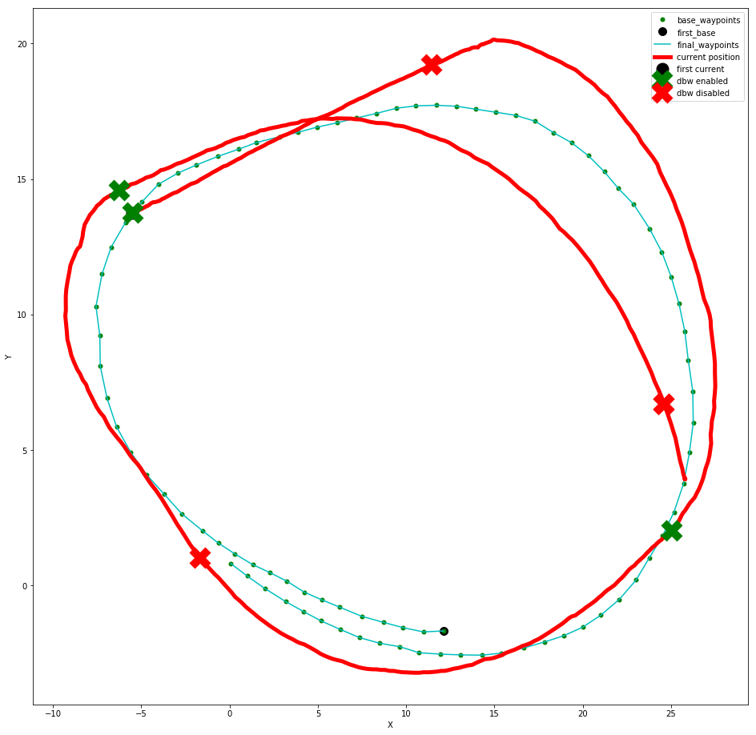

# Term 3 Project 3: System Integration

Project URL: https://github.com/udacity/CarND-Capstone

In this project you will write a Robot Operating System (ROS) that will first steer a virtual car in the simulator,
and later on your code will be run on an actual car named Carla provided by Udacity.

## Known issues & typical problems

- ROS only works on Linux. You will need to install Ubuntu 16.04 if you want a native installation, or use the provided Docker file to run a preconfigured ROS installation on Ubuntu 16.04 inside a virtual machine on your Mac or Windows host.
- Performance really is key here. You can get a long way using the Docker image, but to really test your project on the simulator you will need a fast machine and probably a NVIDIA GPU for the traffic light recognition.
- If your ROS does not connect with the simulator try restarting ROS or the simulator. The setup is a little bit flaky.

## rosbag debugging

When your project submission fails the review feedback alone usually is not enough to find out what went wrong.
However, Udacity will give you a [bag file](http://wiki.ros.org/Bags) that contains all topics data - including logs,
steering messages, raw image data, LIDAR data etc. Let's see how we can get useful info out of it!

### Extract topics as CSV files

```bash
# list all topics in a bagfile
rostopic list -b bagfile.bag

# extract topic 'roslog' into a file `roslog.csv'
rostopic echo -b bagfile.bag -p /roslog > roslog.csv

# extract all topics into multiple CSV files (takes a long time)
for topic in `rostopic list -b bagfile.bag`; do rostopic echo -p -b bagfile.bag $topic > bagfile-${topic//\//_}.csv; done
```

More info on [answers.ros.org](https://answers.ros.org/question/9102/how-to-extract-data-from-bag/).

### Get all images (and video)

**TODO**

### Visualize the rosbag
Once you have all waypoints extracted you can visualize them.
The easiest way is loading them in a *Jupyter Notebook* and display it with *matplotlib*.  
First you need to import the necessary libraries.
```python
import pandas as pd
import matplotlib.pyplot as plt
```

Next is reading the files extracted from the *rosbag* with *pandas*.
To get the x and y values for each waypoint you have to iterate through the *pandas* data set and its columns.
Each waypoint is split into several columns for position and orientation values.
Following script iterates through the columns of one data set and stores only the values of the position in a dictionary called *waypoints*.
```python
wp = pd.read_csv('bagfile_{base, final}_waypoints.csv')
waypoints = dict()
for idx, item in wp.iteritems():
    if "position" in idx:
        waypoint_idx = idx.split(".")[1]
        result = re.search("\d+", waypoint_idx)
        idx_key = int(result.group())
        if idx_key not in waypoints:
            waypoints[idx_key] = dict()
        waypoints[idx_key][idx[-1]] = item.values[0]

# create lists for matplotlib
xs = []
ys = []
for idx, wp in base_waypoints.iteritems():
    xs.append(wp['x'])
    ys.append(wp['y'])
```
Depending on what you want to plot you have to read other waypoints, the current position, or when *DBW* was engaged respectively disengaged.

Lastly you need to plot the values.
```python
plt.rcParams["figure.figsize"] = [16, 16]
p1 = plt.plot([xs[0]], [ys[0]], 'ko', ms=10.0)
p2 = plt.plot(xs, ys, 'go', ms=5.)
p4 = plt.plot(final_xs, final_ys, 'c', ms=5.0)
p5 = plt.plot(current_xs, current_ys, 'r', lw=5.0)
p3 = plt.plot([current_xs[0]], [current_ys[0]], 'ko', ms=15.0)
p6 = plt.plot(dbw_enabled_x, dbw_enabled_y, 'gx', ms=20.0, mew=10.0)
p7 = plt.plot(dbw_disabled_x, dbw_disabled_y, 'rx', ms=20.0, mew=10.0)
plt.xlabel("X", fontsize=10)
plt.ylabel("Y", fontsize=10)
plt.legend((p1[0], p2[0], p3[0], p4[0], p5[0], p6[0], p7[0]), ('first base_waypoint', 'base_waypoints', 'final_waypoints', 'current position', 'first current position', 'dbw enabled', 'dbw disabled'), loc=0)
plt.show()
```

This will result in an image similar to following:


### Replay rosbag with *rviz*  
*ROS* comes with *rviz*, a tool to display the recorded video and LiDAR data.  

#### Manual start
To manually start it you have to launch the `ros core` first, for example with `roslaunch launch/site_test.launch`.  
*You should execute the command in a __different__ terminal.*

```bash
# start rviz without configuration file
rosrun rviz rviz

# start rviz with Udacity's configuration
rosrun rviz rviz -d launch/udacity.rviz

# start rviz with video and lidar only configuration
rosrun rviz rviz -d launch/video_lidar_only.rviz
```

Configuration Files:  
- [udacity.rviz](assets/udacity.rviz)  
- [video_lidar_only.rviz](assets/video_lidar_only.rviz)

#### Automatic start
Aside from manually run *rviz* each time, you can implement it in your launch files.
Just add the following line to a suitable launch file, for example `site_test.launch`.
Preferable somewhere at the beginning to have it up and running before *ROS* is completely started.

```xml
<!-- rviz node with video and lidar only config -->
<node pkg="rviz" type="rviz" name="my_rviz" args="-d $(find styx)../../launch/video_lidar_only.rviz"/>
```

Example launch file: [site_test_rviz.launch](assets/site_test_rviz.launch)  
*Make sure to copy the configuration file to the correct place (`ros/launch/video_lidar_only.rviz`).*

More info on [wiki.ros.org/rviz](http://wiki.ros.org/rviz)

**TODO**


Help wanted - add your knowledge, tips & tricks by editing this file! 🎉
